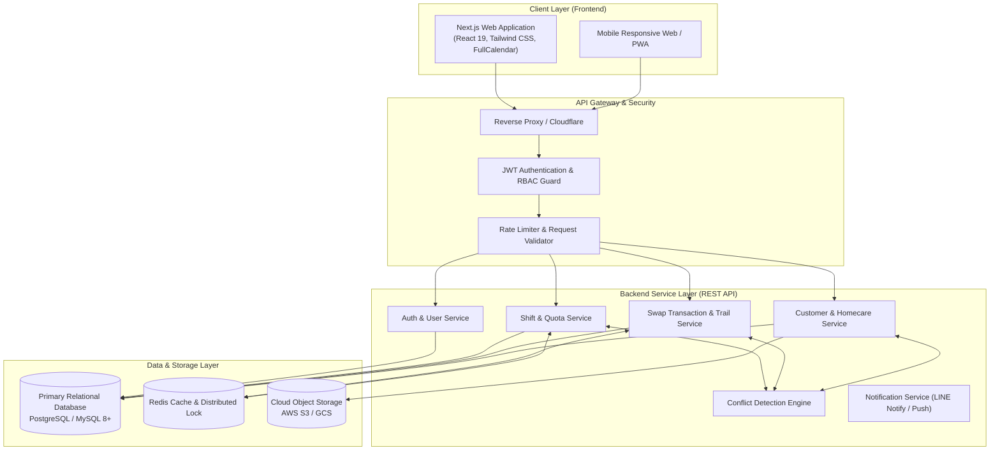
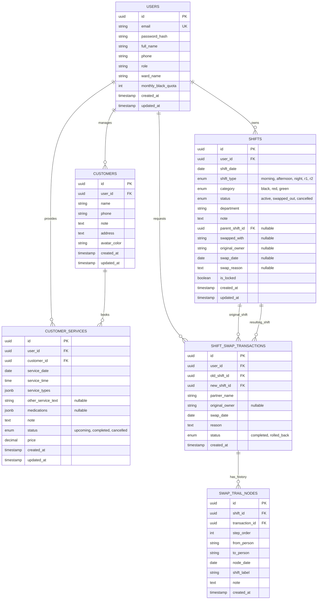
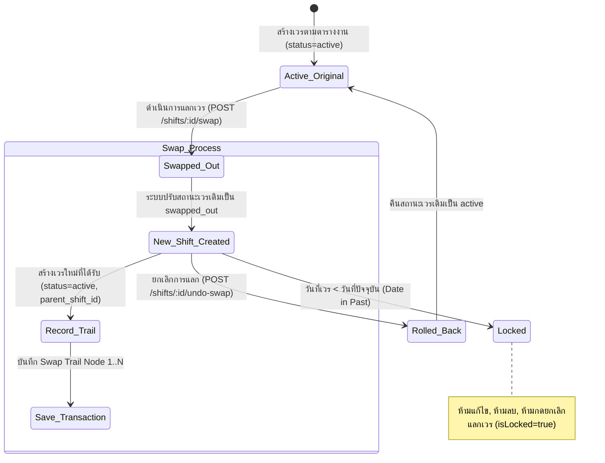

# VenDee (เวรดี) - System Architecture & Design Document
**ระบบบริหารจัดการตารางเวรพยาบาลและการนัดหมายบริการหัตถการ**
*เอกสารสำหรับการออกแบบและพัฒนาสถาปัตยกรรมระบบ (Backend & Database Architecture)*

---

## 1. บทนำและภาพรวมระบบ (Executive Summary)

### 1.1 วัตถุประสงค์ (System Purpose)
**VenDee (เวรดี)** เป็นเว็บแอปพลิเคชันที่ออกแบบมาเพื่อแก้ไขปัญหาการบริหารจัดการตารางเวลาการทำงานของพยาบาลและบุคลากรทางการแพทย์ (Healthcare Workers) ที่มีลักษณะการทำงานแบบผลัดเวรโรงพยาบาล ควบคู่ไปกับการรับงานบริการอิสระ (Private Homecare Services) นอกเวลางาน เช่น ฉีดยาตามบ้าน, ดริปวิตามิน, และส่งเวชภัณฑ์

ระบบมีหัวใจสำคัญอยู่ที่:
1. **การควบคุมโควต้าเวรดำ (Monthly Black Shift Quota):** ตรวจสอบว่าพยาบาลขึ้นเวรประจำครบตามเกณฑ์บังคับของโรงพยาบาลในแต่ละเดือนหรือไม่ (เช่น 14 เวร/เดือน)
2. **ระบบการแลกเปลี่ยนเวรแบบหลายทอด (Complex Shift Swap & Top-up Swap):** รองรับทั้งการแลกตรงกับเพื่อนร่วมงาน (Direct Partner) และการรับแลกเวรต่อยอด (Top-up Chain) พร้อมเก็บบันทึกประวัติและเส้นทางการแลกเปลี่ยน (Swap Trail Audit Timeline)
3. **ระบบป้องกันเวลาทับซ้อนอัจฉริยะ (Intelligent Conflict Detection Engine):** ป้องกันการลงเวลานัดหมายหัตถการเอกชนซ้ำซ้อนกับช่วงเวลาขึ้นเวรโรงพยาบาล โดยมีข้อยกเว้นสำหรับเวรส่งต่อผู้ป่วยฉุกเฉิน (เวร R / Refer)
4. **ความปลอดภัยและการย้อนกลับ (Immutability & Rollback):** เวรที่ผ่านพ้นเวลาไปแล้วจะถูกล็อกอัตโนมัติ (`isLocked: true`) และเวรที่ยังไม่ถึงเวลาสามารถทำการยกเลิกการแลก (Undo Swap) เพื่อคืนสถานะเวรเดิมได้

---

## 2. สถาปัตยกรรมระบบระดับสูง (High-Level Architecture)



### 2.1 ส่วนประกอบของระบบ (Core Components)
1. **Frontend Application**: Next.js 15+ (App Router), Client State Management, Optimistic UI updates.
2. **API Backend**: RESTful API พัฒนาด้วย Node.js (NestJS / Express) หรือ Go / Python (FastAPI).
3. **Database (RDBMS)**: PostgreSQL (แนะนำ) หรือ MySQL 8+ รองรับ ACID Transaction สำหรับการแลกเวรและกู้คืนเวร
4. **In-Memory Cache & Lock (Redis)**:
   - ป้องกัน Concurrency Race Conditions ขณะกดแลกเวรพร้อมกัน (Distributed Mutex Lock)
   - แคชสถิติโควต้าเวรประจำเดือน (Monthly Quota Summary)
5. **Notification Gateway**: เชื่อมต่อ Web Push หรือ LINE Notify แจ้งเตือนเมื่อมีการแลกเวรหรือเตือนก่อนถึงเวลานัดหมาย

---

## 3. แบบจำลองข้อมูลและฐานข้อมูล (Data Models & Database Schema)

### 3.1 Entity Relationship Diagram (ERD)



---

## 4. กฎทางธุรกิจและโมเดลการทำงาน (Business Logic & Domain Rules)

### 4.1 ประเภทของเวรและช่วงเวลาการทำงาน (Shift Types & Periods)

| รหัสเวร | ประเภทเวร (Shift Type) | โค้ดแสดงย่อ | ช่วงเวลาทำงาน | กฎการตรวจจับเวลาชน (Conflict Rule) |
| :--- | :--- | :--- | :--- | :--- |
| `morning` | เวรเช้า | 2 | 08:00 - 16:00 น. | **บล็อกงานบริการ** ในช่วงเวลา 08:00 - 15:59 น. |
| `afternoon` | เวรบ่าย | 3 | 16:00 - 24:00 น. | **บล็อกงานบริการ** ในช่วงเวลา 16:00 - 23:59 น. |
| `night` | เวรดึก | 1 | 00:00 - 08:00 น. | **บล็อกงานบริการ** ในช่วงเวลา 00:00 - 07:59 น. |
| `r1` | เวร R1 (Refer ทีม 1) | R1 | ทั้งวัน (24 ชม.) | **ไม่บล็อกงานบริการ** ยอมให้ลงนัดหมายทับเวลาได้ |
| `r2` | เวร R2 (Refer ทีม 2) | R2 | ทั้งวัน (24 ชม.) | **ไม่บล็อกงานบริการ** ยอมให้ลงนัดหมายทับเวลาได้ |

---

### 4.2 หมวดหมู่เวรและเกณฑ์โควต้า (Shift Categories & Quota Guard)

1. **เวรดำ (Black Shift - `black`):**
   - **ความหมาย:** เวรประจำตามกรอบอัตรากำลังของโรงพยาบาล
   - **กฎบังคับ (Quota Rule):** พยาบาลทุกคนต้องขึ้นเวรดำให้ครบตามเกณฑ์ประจำเดือน (ค่ามาตรฐาน: `14 วัน/เดือน`)
   - **การแลกเวร:** สามารถแลกกับเพื่อนได้ แต่หากแลกเวรดำของตนเองออกไปเป็นเวรแดง จะทำให้ยอดเวรดำลดลง
   - **Quota Simulation Warning:** ก่อนกดยืนยันแลกเวร หากการแลกจะทำให้จำนวนเวรดำในเดือนนั้นลดลงต่ำกว่าโควต้า (เช่น เหลือ 13/14) ระบบต้องส่งคำเตือนหรือแจ้งให้ผู้ใช้รับทราบอย่างชัดเจน

2. **เวรแดง (Red Shift - `red`):**
   - **ความหมาย:** เวรนอกเวลา / เวร OT / เวรช่วย
   - **กฎบังคับ:** ไม่นับเข้าโควต้าเวรดำบังคับ พยาบาลสามารถเลือกรับหรือไม่รับก็ได้ ได้รับค่าตอบแทน OT

3. **เวรเขียว (Green Shift - `green`):**
   - **ความหมาย:** เวร Refer ส่งต่อผู้ป่วยฉุกเฉิน (สอดคล้องกับ `r1` และ `r2`)
   - **สิทธิพิเศษ:** มีความยืดหยุ่นสูง สามารถลงงานบริการเอกชน/หัตถการทับวันที่มีเวรเขียวได้โดยระบบไม่ขัดข้อง

---

### 4.3 กลไกการแลกเวรและประวัติการแลก (Shift Swap & Swap Trail Lifecycle)



#### เงื่อนไขการแลกเวร (Swap Validation Constraints):
1. **Duplicate Check:** ผู้ใช้ต้องไม่มีเวรประเภทเดียวกัน (`shiftType`) ที่มีสถานะ `active` ในวันที่เป้าหมาย (`newDate`) อยู่แล้ว
2. **Conflict Check:** ในวันที่และช่วงเวลาของเวรใหม่ที่จะรับมา ต้องไม่มีนัดหมายบริการหัตถการ (`CustomerServiceRecord`) จองอยู่ล่วงหน้า (ยกเว้นกรณีรับแลกเวร `r1` หรือ `r2`)
3. **Top-up Swap (แลกต่อยอด):** หากเลือกเป็น "แลกต่อยอด" ผู้ใช้ต้องระบุทั้ง `swappedWith` (ผู้ที่ส่งมอบเวรให้โดยตรง) และ `originalOwner` (เจ้าของเวรเดิมตามตาราง)
4. **Swap Trail Assembly:**
   - หากมี `originalOwner`: สร้างโหนดที่ 1 (`from: originalOwner` $\rightarrow$ `to: swappedWith`) และโหนดที่ 2 (`from: swappedWith` $\rightarrow$ `to: ฉัน`)
   - หากเป็นการแลกตรง: สร้างโหนดเดี่ยว (`from: swappedWith` $\rightarrow$ `to: ฉัน`)
5. **Undo / Rollback Capability:**
   - ตรวจสอบ `is_locked` (หาก `shift_date < CURRENT_DATE` จะปฏิเสธการ Rollback ทันที)
   - เมื่อ Rollback สำเร็จ: เวรใหม่จะถูกลบ/ยกเลิก และเวรต้นทาง (`parent_shift_id`) จะถูกดึงกลับมาเป็น `active` ทันที

---

### 4.4 กลไกการตรวจจับเวลาชนกัน (Conflict Detection Engine)

การนัดหมายบริการลูกค้า (`CustomerService`) มีเงื่อนไขการชนกับเวรโรงพยาบาล (`ShiftRecord`) ดังนี้:

```typescript
function isTimeInShift(time: string, shiftType: ShiftType): boolean {
  if (shiftType === "r1" || shiftType === "r2") return false; // เวร R ไม่ชน
  if (shiftType === "morning") return time >= "08:00" && time < "16:00";
  if (shiftType === "afternoon") return time >= "16:00" && time <= "23:59";
  if (shiftType === "night") return (time >= "00:00" && time < "08:00") || time === "24:00";
  return false;
}
```

- **เมื่อบันทึกงานบริการลูกค้า (POST /services):** Backend จะค้นหาว่ามีเวรโรงพยาบาลสถานะ `active` ในวันและเวลาดังกล่าวหรือไม่ หากพบ จะตอบกลับ `409 Conflict` ทันทีพร้อมแจ้งชื่อเวรและช่วงเวลา
- **เมื่อบันทึกหรือรับแลกเวรโรงพยาบาล (POST /shifts หรือ POST /shifts/:id/swap):** Backend จะตรวจสอบย้อนกลับว่ามีงานบริการลูกค้าในวันและช่วงเวลาของเวรใหม่หรือไม่ หากมี จะตอบกลับ `409 Conflict` ทันทีพร้อมแจ้งชื่อลูกค้าและเวลาที่นัดหมายไว้

---

## 5. สถาปัตยกรรมความปลอดภัยและการเข้าถึง (Security & Access Control)

1. **Authentication:** Stateless JWT Token (Access Token อายุ 15-30 นาที, Refresh Token อายุ 7-30 วัน เก็บใน Secure HttpOnly Cookie)
2. **Data Isolation (Multi-Tenancy):**
   - ผู้ใช้แต่ละคนมีสิทธิ์เข้าถึง ดู แก้ไข และลบเฉพาะข้อมูลงานบริการลูกค้า (`Customer`) และนัดหมาย (`CustomerService`) ของตนเองเท่านั้น (`user_id = auth.uid`)
   - ตารางเวร (`Shifts`) และสถิติโควต้าแยกตามผู้ใช้ แต่ระบบค้นหาเพื่อนร่วมงาน (`Colleagues`) สามารถดูรายชื่อพยาบาลในแผนกเดียวกันเพื่อเลือกแลกเวรได้
3. **Data Integrity & Concurrency Control:**
   - การทำ Swap Shift และ Undo Swap ต้องอยู่ภายใน **Database Transaction (BEGIN ... COMMIT)** เพื่อรับประกันว่าการเปลี่ยนสถานะเวรเดิมและการสร้างเวรใหม่จะสำเร็จพร้อมกัน 100% (All-or-Nothing)
   - ใช้ Database Unique Constraint หรือ In-Memory Mutex Lock ป้องกันการกดบันทึกซ้ำซ้อน (Idempotency)

---

## 6. ข้อกำหนดด้านประสิทธิภาพและความพร้อมใช้งาน (Non-Functional Requirements)

- **Response Time:** API Endpoint ทั่วไปต้องตอบสนองภายใน `< 200ms` (p95)
- **High Concurrency for Swaps:** รองรับช่วงสิ้นเดือนที่มีการจัดตารางและแลกเวรหนาแน่น (Peak load)
- **Data Retention & Auditability:** ประวัติการแลกเวร (`SwapTrailNodes` และ `ShiftSwapTransactions`) ต้องไม่มีการ Hard Delete เพื่อใช้เป็นหลักฐานยืนยันกรณีมีข้อพิพาทเรื่องเวร
